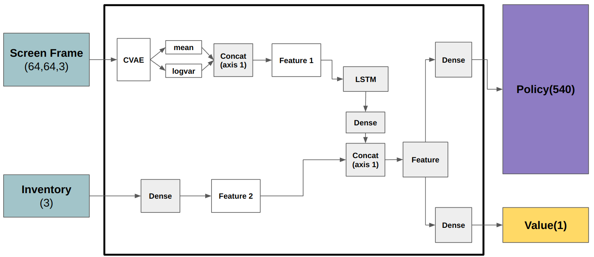
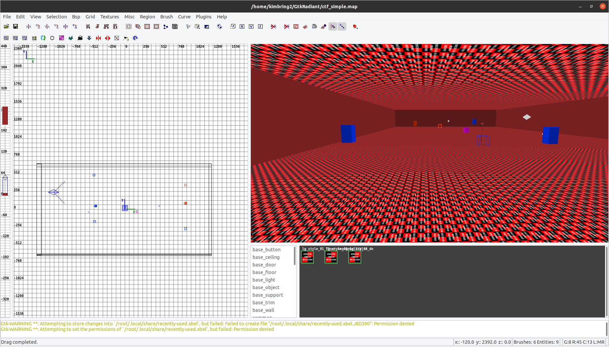
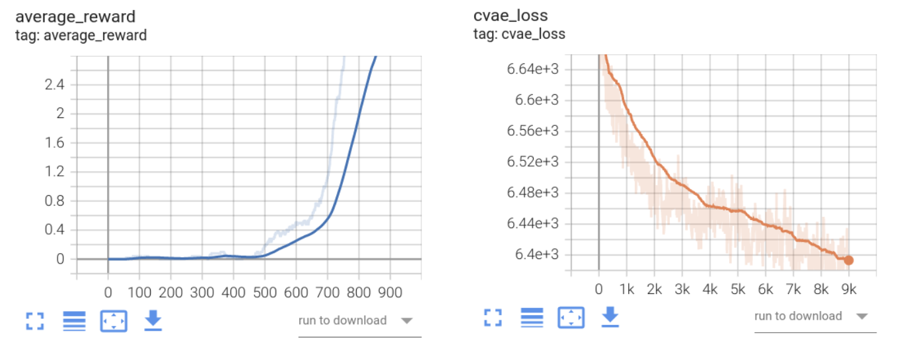
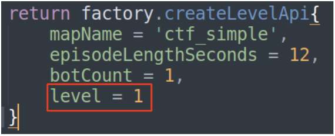

# Introduction
Implementation of [Capture the Flag: the emergence of complex cooperative agents](https://deepmind.com/blog/article/capture-the-flag-science) of the DeepMind. I first describe how to set the DeepMind lab for running the Capture The Flag map. Next, I also add a way how to design your own simple CTF map. Finally, I am going to train the agent for the Capture the Flag game in the 1 vs 1 case. The scale of the network will be a little smaller than the original paper. However, you can have a basic knowledge of how to build the agent for the CTF game.

# Dependencies
1. Python 3.8
2. tensorflow==2.8.4
3. tensorflow-probability==0.12.0
4. opencv-python==4.2.0.34
5. numpy==1.21.0
6. dm-env
7. pygame
8. Bazel==6.4.0(sudo apt-get install gettext)

# Demo video 
## 1. To make everything simple, the Capture the Flag map is made for the 1 vs 1 game without any items and obstacles.

[](https://youtu.be/88dNnX357eY
 "Capture The Flag Implementation - Click to Watch!")
<strong>Click to Watch!</strong>

This environment only needs 7 actions because the map height is the same at every place.

## 2. There is also a map for the 3 vs 3 games that is provided by the DeepMind Lab
[](https://www.youtube.com/watch?v=5UYPigIJl6s
 "Capture The Flag Implementation - Click to Watch!")
<strong>Click to Watch!</strong>

This environment needs 11 actions because there are many height changes during game playing.

# Agent Network Architecture
## Kill model


# Setting
At first, we are going to run the Capture The Flag map in human-playing mode. Try to follow the below instructions for that.

## 1. Check you can run the default environment
You need to clone the official DMLab from https://github.com/deepmind/lab. After that, run one of the human play examples of DMLab to check you can run the DMLab well.

Next, copy Capture the flag files to the DeepMind lab folder that you cloned. Please set the path as your own.
```
$ sh map_copy_dmlab.sh [deepmind lab path]
e.g $ sh map_copy_dmlab.sh /home/kimbring2/lab
```

Finally, you can run the Capture the Flag game using the '**bazel run :game -- -l ctf_simple -s logToStdErr=true**' command from your DMLab root.

## 2. PIP install
It is possible that you run the DMLab from a Python script. Before, you should install the Python package of DMLab. Follow [official instructions](https://github.com/deepmind/lab/blob/master/python/pip_package/README.md) to generate the install file for Python. Below is an example command in my workspace.
```
$ export PYTHON_BIN_PATH="/usr/bin/python3"
$ bazel build -c opt --python_version=PY3 //python/pip_package:build_pip_package
$./bazel-bin/python/pip_package/build_pip_package /tmp/dmlab_pkg
$ python3 -m pip install /tmp/dmlab_pkg/deepmind_lab-1.0-py3-none-any.whl
```

After installing, run the [env_test.py](https://github.com/kimbring2/dmlab_ctf/blob/main/env_test.py) file. Check that you can import DmLab using 'import deepmind_lab' code from the Python script.

The paths of cloned DMLab and Python installed are different. Therefore, you need to copy the map files to the Python package path.
```
$ sh map_copy_python.sh [deepmind lab path of Python]
e.g $ sh map_copy_python.sh /home/kimbring2/.local/lib/python3.8/site-packages/deepmind_lab
```

# How to customize the map
You can design your own map using a program called GtkRadiant. I also make the ctf_simple map like the below image.



For that, you need to install three programs mentioned in https://github.com/deepmind/lab#upstream-sources. After that, open GtkRadiant. You just need to make a closed room and put essential components for Capture The Flag game such as info_player_intermission, team_ctf_blueflag, team_ctf_redflag, team_ctf_blueplayer, team_ctf_redplayer, team_ctf_bluespawn and team_ctf_redspawn.

After installing those packages, please download the map files from [baseq3](https://github.com/nrempel/q3-server/tree/master/baseq3). You need to copy those files under ```ioq3/build/release-linux-x86_64/baseq3```.

After that, please check that you can play the ```Quake 3 Arena``` game by executing the ```ioq3/build/release-linux-x86_64/ioquake3.x86_64``` file.

If you finish designing a map and make a map format file, you should convert it to a binary format called the bsp, aas. The DeepMind also provides [a tool for that](https://github.com/deepmind/lab/blob/master/deepmind/level_generation/compile_map.sh).

Before running that script, you need to modify the Q3MP, and BSPC path of that file according to your folder structure. Below is an example of my workspace.

```
readonly Q3MP="/home/kimbring2/GtkRadiant/install/q3map2"
readonly BSPC="/home/kimbring2/lab/deepmind/level_generation/bspc/bspc"
```

In my case, I use the command 'sudo ./compile_map.sh -a /home/kimbring2/GtkRadiant/test' for conversion. Please beware there is no gap in your map. That will make an error named the leaked.

# Lua script
You also need to prepare a Lua script for running a map file with DmLab. Tutorial for that can be found at [minimal_level_tutorial](https://github.com/deepmind/lab/blob/master/docs/developers/minimal_level_tutorial.md). The only important thing is setting the game type as CAPTURE_THE_FLAG.

# Training agents to kill the enemy
You can train the agent using the below command. The experiment name should be one of 'kill', or 'flag'. The 'kill' environment gives a reward when the agent kills the enemy agent. Otherwise, the agent can obtain the reward when it grabs the enemy team flag and brings it back to the home team base in the 'flag' environment

```
$ ./run_reinforcement_learning.sh [number of envs] [gpu use] [batch size] [unroll length] [experiment name]
e.g. $ ./run_reinforcement_learning.sh 64 True 64 50 kill
```

Tensorboard log file is available from the '/kill/tensorboard_actor' and '/kill/tensorboard_learner' folder. 


# Select the bot skill level
There are a total of 4 difficult levels of bot. You can set it by changing the level parameter of [ctf_simple.lua](https://github.com/kimbring2/dmlab_ctf/blob/main/ctf_simple.lua).



# Reward
Because the goal of this game is captureing the flag, killing enemy is not included in reward.
| Event  | Reward |
| ------------- | ------------- |
| pick up the enermy flag | 0.5 |
| return the picked up flag to my base | 2.0 |

# Evaluting Result
You can evaluate the trianed agent using below command.
```
$ python run_evaluation.py --exp_name [experiment name] --model_name [saved model name]
e.g. $ python3.8 run_evaluation.py --exp_name kill --model_name model_8000
```

I also share the pretrained weight of my own through Google Drive. Please download from below links
- Kill agent: https://drive.google.com/drive/folders/1bv9vxXrFJCfRLZTI42sV6SWJ4cA_rOX3?usp=sharing


# Reference
1. DeepMind Lab: https://github.com/deepmind/lab
2. CTF map design tip: https://www.quake3world.com/forum/viewtopic.php?f=10&t=51042
