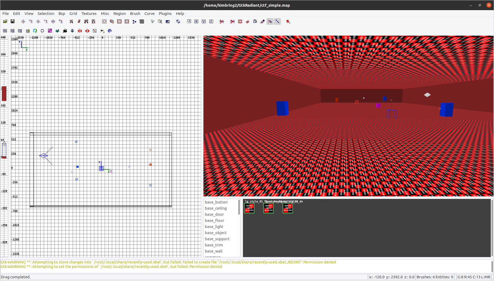
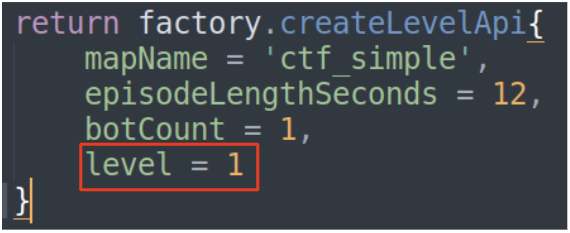

# Introduction
Implementation of [Capture the Flag: the emergence of complex cooperative agents](https://deepmind.com/blog/article/capture-the-flag-science) of  DeepMind. I first describe how to set the DeepMind lab for running the Capture The Flag map. Next, I also add a way how to desing your own simple CTF map. Finally, I am going to train the agent for Capture the Flag game in 1 vs 1 case. The scale of network will be little small than original paper. However, you can know a basic knowleade how to build the agent for CTF game.

# Version
1. Python 3.8
2. tensorflow==2.8.4
3. tensorflow-probability==0.12.0
4. opencv-python==4.2.0.34
5. numpy==1.21.0

# Demo video 
## 1. To make everything simple, Capture the Flag map is made for the 1 vs 1 game without any item and obstacle.

[](https://youtu.be/88dNnX357eY
 "Capture The Flag Implementation - Click to Watch!")
<strong>Click to Watch!</strong>

This environment only needs 7 number of actions because map height is same at every place.

## 2. There is also map for the 3 vs 3 game that is provided from the DeepMind Lab
[](https://www.youtube.com/watch?v=5UYPigIJl6s
 "Capture The Flag Implementation - Click to Watch!")
<strong>Click to Watch!</strong>

This environment needs a 11 actions because there are many height change during game playing.

# Setting
At first, we are going run the Capture The Flag map as human playing mode. Try to follow the below intructions for that.

1. You need to clone the official DeepMind Lab from https://github.com/deepmind/lab.
2. Check that you can run one of human play example of DMLab.
3. Place [ctf_simple.aas](https://github.com/kimbring2/dmlab_ctf/blob/main/ctf_simple.aas), [ctf_simple.bsp](https://github.com/kimbring2/dmlab_ctf/blob/main/ctf_simple.bsp) file into under [built](https://github.com/deepmind/lab/tree/master/assets/maps/built) folder of your DMLab folder.
4. Copy [ctf_simple_factory.lua](https://github.com/kimbring2/dmlab_ctf/blob/main/ctf_simple_factory.lua) file under [factories](https://github.com/deepmind/lab/tree/master/game_scripts/factories) folder and [ctf_simple.lua](https://github.com/kimbring2/dmlab_ctf/blob/main/ctf_simple.lua) file under [levels](https://github.com/deepmind/lab/tree/master/game_scripts/levels) folder.
5. Run '**bazel run :game -- -l ctf_simple -s logToStdErr=true**' command from your DMLab root. 
6. You can also run the 3 vs 3 environment that is already existed in DeepMind Lab [ctf_multi_factory.lua](https://github.com/kimbring2/dmlab_ctf/blob/main/ctf_multi_factory.lua), and [ctf_multi.lua](https://github.com/kimbring2/dmlab_ctf/blob/main/ctf_multi.lua) file to same place of single game.
7. Run '**bazel run :game -- -l ctf_multi -s logToStdErr=true**' command from your DMLab root. 

# PIP install
Next, we need to run same environment from Python script.

1. You need to install DMLab using PIP package of Python. Follow official intruction for that from https://github.com/deepmind/lab/blob/master/python/pip_package/README.md. Below is example command in my workspace.
```
$ export PYTHON_BIN_PATH="/usr/bin/python3"
$ bazel build -c opt --python_version=PY3 //python/pip_package:build_pip_package
$./bazel-bin/python/pip_package/build_pip_package /tmp/dmlab_pkg
$ python3 -m pip install /tmp/dmlab_pkg/deepmind_lab-1.0-py3-none-any.whl
```
3. After installing the whl file that is generated from first step, you need to copy the [ctf_simple.lua](https://github.com/kimbring2/dmlab_ctf/blob/main/ctf_simple.lua) file under the 'deepmind_lab/baselab/game_scripts/levels' path of installed Python package. Next, copy the [ctf_simple_factory.lua](https://github.com/kimbring2/dmlab_ctf/blob/main/ctf_simple_factory.lua) file under 'deepmind_lab/baselab/game_scripts/factories' folder. Finally, copy the [ctf_simple.aas](https://github.com/kimbring2/dmlab_ctf/blob/main/ctf_simple.aas), [ctf_simple.bsp](https://github.com/kimbring2/dmlab_ctf/blob/main/ctf_simple.bsp) file under 
'deepmind_lab/baselab/maps' folder.
4. Open [CTF_Single_Test.ipynb](https://github.com/kimbring2/dmlab_ctf/blob/main/CTF_Single_Test.ipynb) file.
5. Check that you can import DmLab using 'import deepmind_lab' code.
6. Run entire Jupyter Notebook code.
7. You can also test the 3 vs 3 environment after copying the [ctf_multi_factory.lua](https://github.com/kimbring2/dmlab_ctf/blob/main/ctf_multi_factory.lua), and [ctf_multi.lua](https://github.com/kimbring2/dmlab_ctf/blob/main/ctf_multi.lua) file to same place of single game. After copying them, open [CTF_Multi_Test.ipynb](https://github.com/kimbring2/dmlab_ctf/blob/main/CTF_Multi_Test.ipynb) file to check.

# How to customize map
You can design your own map using program called GtkRadiant. I also make the ctf_simple map like a below image.



For that, you need to install three program mentioned in https://github.com/deepmind/lab#upstream-sources. After that, open GtkRadiant. You just need to make a closed room and put essential component for Capture The Flag game sush as info_player_intermission, team_ctf_blueflag, team_ctf_redflag, team_ctf_blueplayer, team_ctf_redplayer, team_ctf_bluespawn and team_ctf_redspawn.

If you finish designing map and make a map format file, you should convert it to binary format called the bsp, aas. The DeepMind also provides [tool for that](https://github.com/deepmind/lab/blob/master/deepmind/level_generation/compile_map.sh).

Before runnthing that script, you need to modify the Q3MP, and BSPC path of that file according to your folder structrue. Below is example of my workspace.

```
readonly Q3MP="/home/kimbring2/GtkRadiant/install/q3map2"
readonly BSPC="/home/kimbring2/lab/deepmind/level_generation/bspc/bspc"
```

In my case, I use a command 'sudo ./compile_map_test.sh -a -m /home/kimbring2/GtkRadiant/test.map' for conversion. Please beware there is no gap in your map. That will make error named the leaked.

# Lua script
You also need to prepare a Lua script for running map file with DmLab. Tutorial for that can be found at [minimal_level_tutorial](https://github.com/deepmind/lab/blob/master/docs/developers/minimal_level_tutorial.md). The only important thing is setting the game type as CAPTURE_THE_FLAG. 

# Training agent
You can train the agent using below command.

```
$ ./run_reinforcement_learning.sh [number of envs] [gpu use]
```

# Select the bot skill level
There are total 4 difficult level of bot. You can set it by changing level parameter of [ctf_simple.lua](https://github.com/kimbring2/dmlab_ctf/blob/main/ctf_simple.lua).



# Reward
Because the goal of this game is captureing the flag, killing enemy is not included in reward.
| Event  | Reward |
| ------------- | ------------- |
| pick up the enermy flag | 0.5 |
| return the picked up flag to my base | 2.0 |

# Reference
1. DeepMind Lab: https://github.com/deepmind/lab
2. CTF map design tip: https://www.quake3world.com/forum/viewtopic.php?f=10&t=51042
